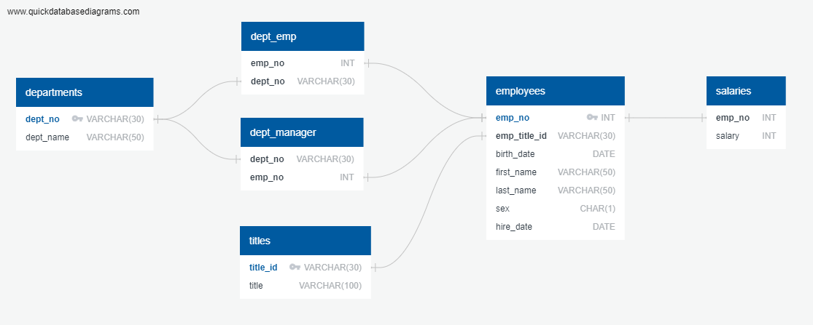

# sql-challenge
SQL module challenge

I first created a database diagram using Quick DBD tool. I have exported the () and the [postgres](EmployeeSQL/QuickDBD-export-postgres.sql) files from Quick DBD. 
Then, I have created a [create_tables](EmployeeSQL/create_tables.sql) schema file and created the tables with the required structure.
I have done the data analysis in the [data_analysis](EmployeeSQL/data_analysis.sql) file. 

